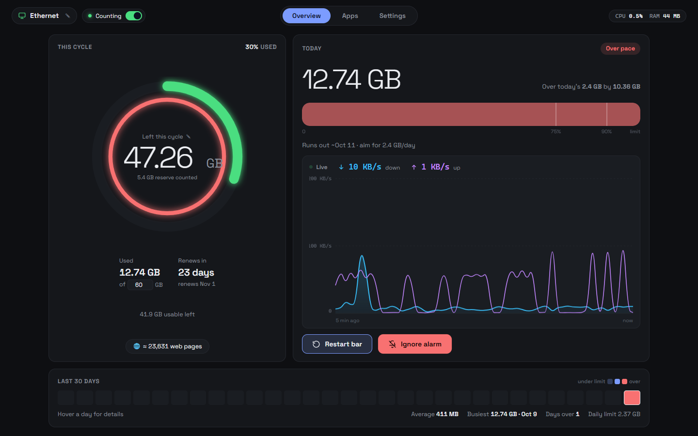
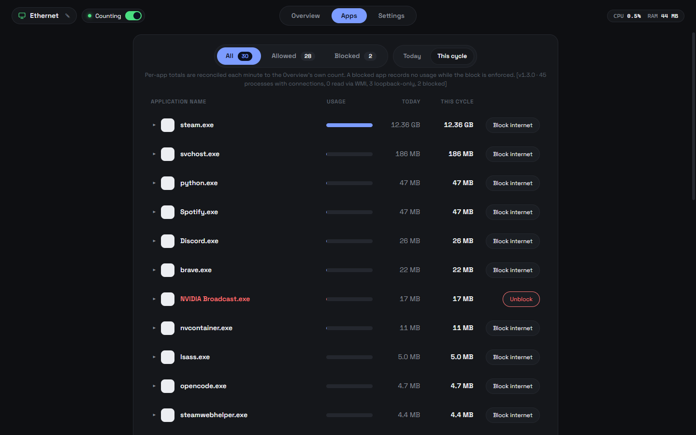
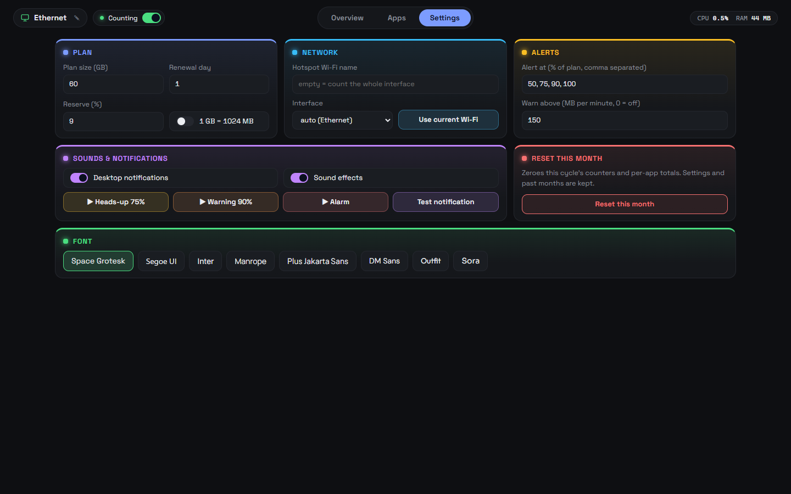
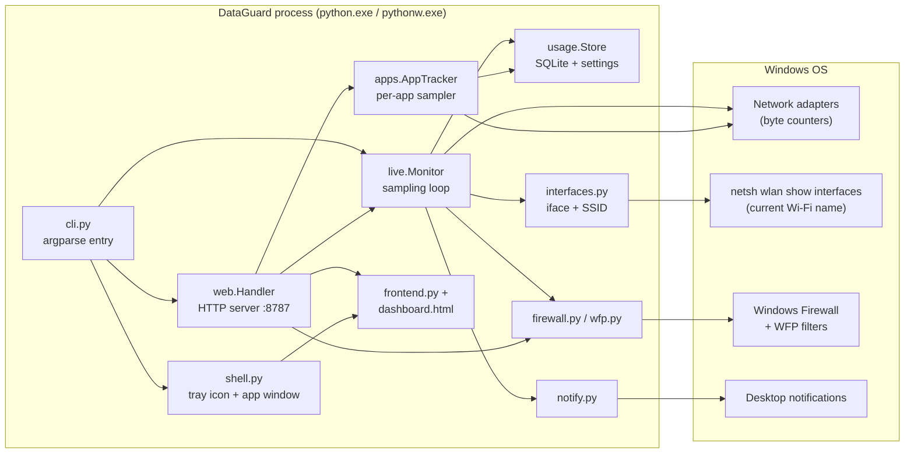
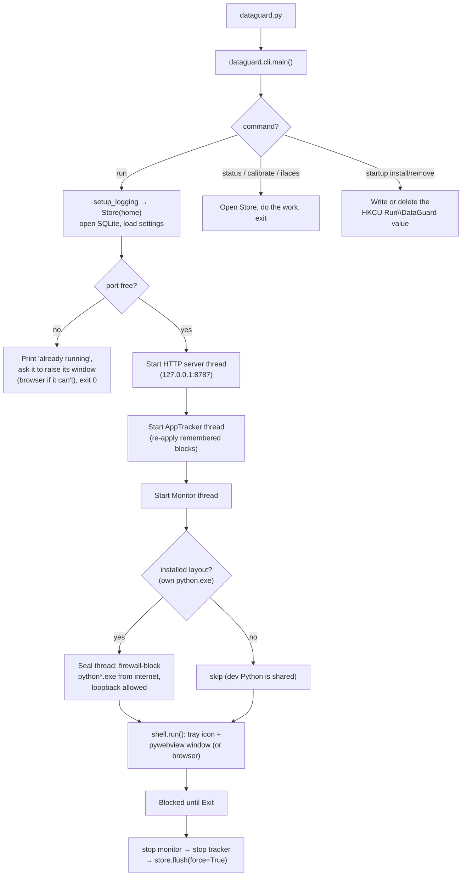
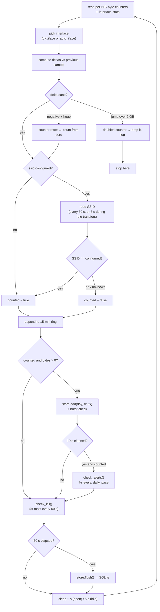
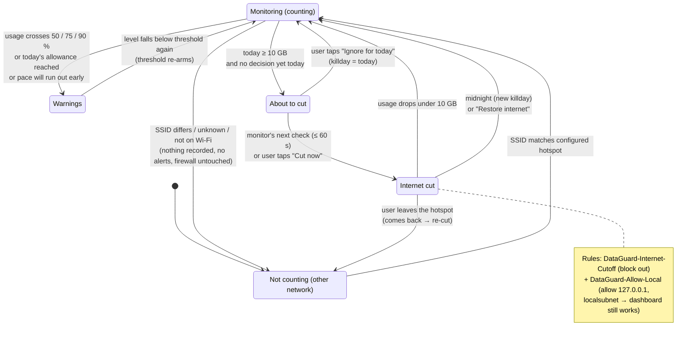
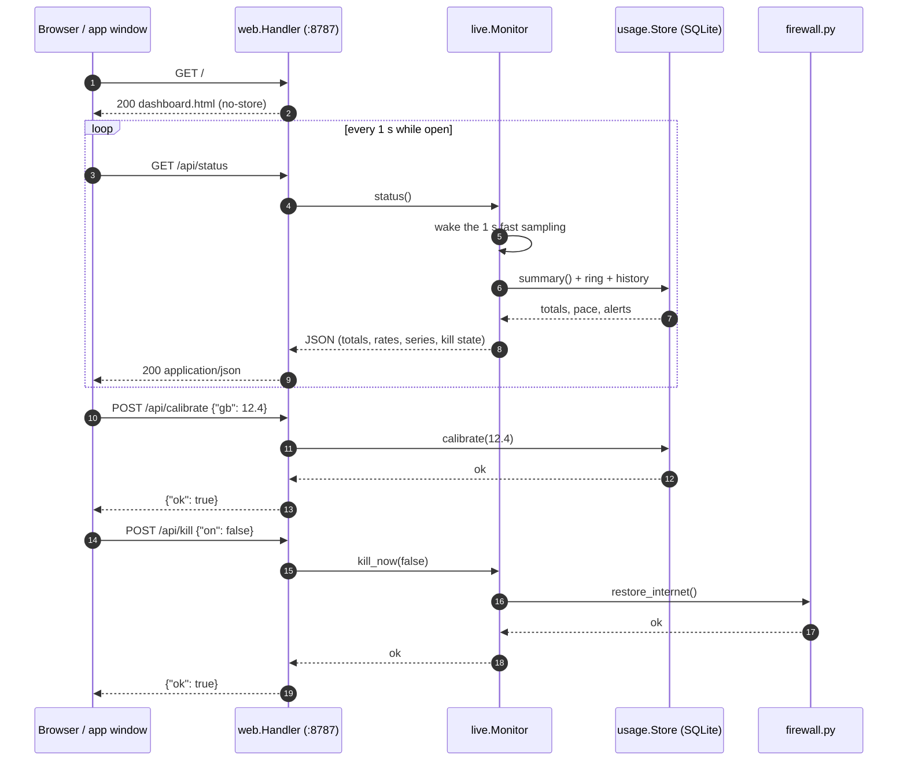
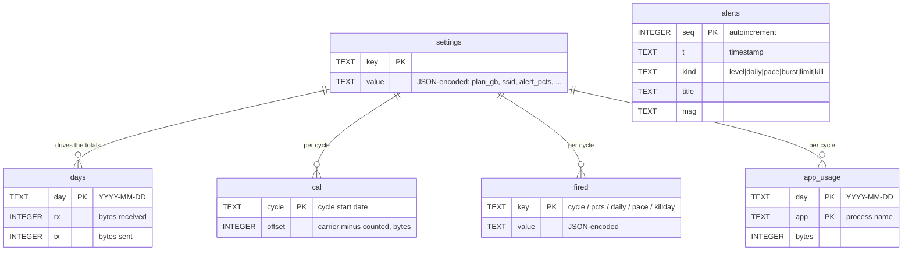
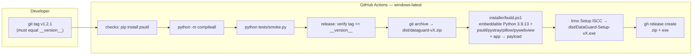

# DataGuard

**Know how many GB you have left — before the carrier tells you.**

DataGuard is a small Windows-first desktop tool that counts every byte your laptop sends and
receives while it is tethered to your phone's hotspot, totals it against your billing cycle, warns
you before you run out, and can cut the internet when a daily cap is hit.

**[⬇ Download DataGuard 1.2.1](https://github.com/yassine808/network-tracker/releases/latest)**
— per-user install, no admin rights, no Python required (the installer bundles everything).
Prefer to build it yourself? See [Install](#install) below.



**Highlights**

- **Exact, local, early.** Carrier apps are slow, vague and reactive. DataGuard is the opposite:
  per-second byte counters, one local SQLite file, alerts before you run out.
- **Two-second glance.** GB left and today's pace are the first-read elements; everything else
  supports them.
- **Hotspot-only by design.** Only your configured Wi-Fi network is counted, alerted on and
  blocked — on any other network DataGuard records nothing and stays silent. Enabling a block
  costs one UAC prompt per network change, not one per app.
- **Real firewall blocks per app.** Block a hungry program from the Apps page with one click
  (Windows Firewall + WFP); the block steps aside everywhere except your hotspot.
- **Privacy is structural.** One process, one required package (`psutil`), a local dashboard at
  `http://127.0.0.1:8787`, no accounts, no cloud, **no outbound internet connections at all** —
  the installed app firewall-seals its own interpreter so it physically cannot phone home.

Current version: **1.2.1** (`dataguard/__init__.py`)

---

## Table of contents

1. [Install](#install)
2. [First run — 60 seconds to a correct meter](#first-run--60-seconds-to-a-correct-meter)
3. [Using the dashboard](#using-the-dashboard)
4. [Command line](#command-line)
5. [How the numbers are computed](#how-the-numbers-are-computed)
6. [Settings reference](#settings-reference)
7. [HTTP API](#http-api)
8. [How it works — architecture & lifecycle](#how-it-works--architecture--lifecycle)
9. [Data & privacy](#data--privacy)
10. [Development](#development)
11. [Troubleshooting](#troubleshooting)
12. [Uninstall](#uninstall)

---

## Install

### Option A — the installer (recommended)

1. Download `DataGuard-Setup-v<version>.exe` from the
   [GitHub Releases page](https://github.com/yassine808/network-tracker/releases)
   (current: `DataGuard-Setup-v1.2.1.exe`).
2. Run it. It installs per-user into `%LOCALAPPDATA%\Programs\DataGuard` — **no admin rights needed**.
3. Finish the wizard. **"Start DataGuard now"** is pre-checked, so DataGuard starts and opens the
   dashboard. Auto-start at every login is set up for you (no checkbox to miss). Silent installs
   (`/SILENT`, `/VERYSILENT`) do the same automatically.

The installer bundles its own embeddable Python 3.9 + all dependencies, so you do not need Python
installed.

### Option B — run from source

Requires Python 3.8+ (3.9 recommended).

```powershell
git clone https://github.com/yassine808/network-tracker.git
cd network-tracker
pip install psutil              # the one required package

# optional: tray icon + native app window + app icons on the Apps page
pip install pystray pillow pywebview

python dataguard.py run --open  # start monitoring and open the dashboard
```

Without `pystray`/`pywebview` everything still works — you just get the browser tab instead of a
native window and tray icon.

### Option C — portable zip

Grab `dataguard-v<version>.zip` from Releases, unpack it, and run `python dataguard.py run --open`
with any Python 3.8+ that has `psutil`.

---

## First run — 60 seconds to a correct meter

| # | Action | Where |
|---|--------|-------|
| 1 | **Set your plan size.** Click the GB figure in the ring → type the plan → Enter. Or Settings → Plan. | Overview / Settings |
| 2 | **Set the renewal day** (the day of the month your plan resets). | Settings → Plan |
| 3 | **Name your hotspot.** Click the pencil next to the Wi-Fi name in the header, or Settings → Network → *Use current Wi-Fi*. **Only this exact network is counted.** Leave it empty to count every byte on the selected interface. | Header / Settings |
| 4 | **Calibrate against the carrier.** Your carrier also counts your *phone's* traffic, which the laptop cannot see. Type `dataguard.py calibrate 12.4` (or set *GB left* in the ring) whenever the carrier app and DataGuard disagree. | CLI / Overview |
| 5 | Optional: set your **reserve** (a % of the plan held back for phone overhead and rounding — 5 % of 60 GB = 3 GB) and **alert thresholds**. | Settings |

That's it. From now on the Overview answers two questions instantly: *how much is left* and *is
today's pace safe*.

---

## Using the dashboard

Open `http://127.0.0.1:8787` (or the app window / tray icon). Keyboard shortcuts: **1** Overview,
**2** Apps, **3** Settings.

### Overview


- **This cycle** — a ring showing % used (used + reserve over plan) and an editable *GB left* figure,
  used-of-plan, days to renewal. Both numbers are editable in place; Enter or click-away commits.
- **Today** — today's total against your safe daily allowance, with the live up/down rate and a
  5-minute traffic chart. *Restart bar* re-zeroes the bar (not the total); *Ignore alarm* silences
  today's cut warning.
- **Last 30 days** — a heat map of daily usage with average, peak and days-over-limit.
- **Kill banner** — appears when the 10 GB daily cap has cut the internet; one button restores it.

### Apps (Windows only)



- **Who's using data right now?** — press *Measure (3 s)* for a ranked estimate of active programs.
- **Data by app** — per-app totals for today / this cycle / 30 days, each row expandable to a 30-day
  bar chart, with a **Block internet** button per app (writes real Windows Firewall + WFP rules).
  **Blocks are gated to your hotspot**: each rule applies tri-state — on your configured Wi-Fi the
  app is blocked, on any other network it is allowed, and DataGuard flips the rules with a single
  UAC prompt per network change (not one per app). Windows system processes can never be blocked.

### Settings



| Card | What it controls |
|------|------------------|
| Plan | Plan size (GB), renewal day, reserve %, `1 GB = 1024 MB` (binary carriers) |
| Network | Hotspot Wi-Fi name (SSID), interface (`auto` picks the Wi-Fi adapter) |
| Alerts | Alert thresholds (% of plan, comma separated), burst warning (MB/min, 0 = off) |
| Sounds & notifications | Desktop notifications, sound effects, preview buttons, test notification |
| Font | Dashboard typeface (8 choices, saved in the browser) |
| Reset this month | Zeroes this cycle's counters and per-app totals. Settings and past months are kept. |

---

## Command line

```text
python dataguard.py [global options] <command>
```

| Command | What it does |
|---------|--------------|
| `run [--open] [--port N]` | Start the monitor + dashboard (default command). `--open` opens the window/tab. |
| `status` | Print a summary in the terminal (live if the app is running, saved data otherwise). |
| `calibrate <gb>` | "My carrier says I've used X GB this cycle" — sets an offset so DataGuard matches. |
| `ifaces` | List network interfaces; `*` marks the one being counted. |
| `startup install` | Windows: start hidden at every login (writes a `DataGuard` value under `HKCU\...\CurrentVersion\Run`). |
| `startup remove` | Undo `startup install`. |

Global option: `--home <folder>` or env `DATAGUARD_HOME` — put settings and history somewhere else
(handy for tests and portable installs).

Examples:

```powershell
python dataguard.py run --open
python dataguard.py status
python dataguard.py calibrate 12.4
python dataguard.py ifaces
python dataguard.py --home D:\portable-dg run
```

---

## How the numbers are computed

- **Counting rule.** Every 1 s (dashboard open) or 5 s (idle) the monitor reads the per-interface
  byte counters and stores the delta for the configured interface. If an SSID is configured, the
  delta is recorded **only** when the current Wi-Fi name matches it exactly. Off that network:
  nothing is recorded, no alerts fire, no projections are drawn, the firewall is never touched.
- **Billing cycle.** `[reset_day of this month, reset_day of next month)`. All totals are recomputed
  from the daily rows on every read — there is no running counter to drift.
- **Reserve.** `budget = plan × (1 − reserve_pct/100)`. The reserve is shown as part of the plan but
  counted as used in the ring from day one, so the plan figure stays whole while the spendable
  budget is honest. GB-left never subtracts it.
- **Calibration.** Stores `{cycle, offset}` where `offset = carrier_gb − counted`. Applied only to
  the cycle it was recorded in; a new cycle starts clean.
- **Pace.** Average of whole calendar days (last 7, empty days count as zero), marked reliable after
  two full days. Projected usage = used + avg × days remaining; if that exceeds the budget the app
  predicts the run-out date and how many days early that is.
- **Daily allowance** = `(budget − used_without_today) / days_left`.
- **Alerts** at 50/75/90/100 % (configurable), when today's allowance is reached, when pace says
  you'll run out early, and when traffic exceeds the burst threshold (default 150 MB/min).
- **Kill switch.** If today's total on the configured hotspot passes **10 GB**, DataGuard adds a
  Windows Firewall rule blocking all outbound internet while keeping loopback and the local subnet
  (the dashboard and printer keep working). It lifts: at midnight, when usage drops back under the
  cap, when you leave the hotspot, or when you press *Restore internet*. The pre-cut warning can be
  *ignored for today*.
- **Counter sanity.** Jumps over 2 GB per sample (a doubled Windows counter) are rejected; a counter
  that goes backwards (adapter restart) is re-based to zero instead of subtracted.

---

## Settings reference

Defaults live in `dataguard/settings.py` (`DEFAULTS`); all are validated on write.

| Key | Default | Meaning |
|-----|---------|---------|
| `plan_gb` | `60` | Size of your data plan in GB |
| `reset_day` | `1` | Day of month the plan renews (1–31) |
| `reserve_pct` | `5` | % of the plan held back (phone overhead, rounding) |
| `ssid` | `""` | Hotspot Wi-Fi name; only that network is counted (`""` = count everything) |
| `iface` | `"auto"` | Interface to watch, or `auto` (picks the Wi-Fi adapter, else busiest real one) |
| `alert_pcts` | `[50, 75, 90, 100]` | Alert thresholds, up to 8 values between 1 and 300 |
| `burst_mb_per_min` | `150` | Warn when a download runs faster than this (0 = off) |
| `binary_gb` | `false` | `true` if your carrier counts 1 GB = 1024 MB |
| `notify` | `true` | Desktop notifications |
| `port` | `8787` | Dashboard port (1024–65535) |

Hard-coded safety values: `KILL_GB = 10` (daily internet-cut cap, `dataguard/live.py`),
`KEEP_DAYS = 400` (history retention), `LOG_CAP = 3 MB` (`dataguard.log`).

---

## HTTP API

Local only. The server rejects any `Host:` header that is not `127.0.0.1`/`localhost` (DNS-rebinding
protection), accepts JSON only, and caps request bodies at 20 000 bytes.

| Method | Path | Purpose |
|--------|------|---------|
| GET | `/` | The dashboard page (self-contained HTML) |
| GET | `/api/status` | Full status: totals, pace, alerts, live rates, history, system stats |
| GET | `/api/top` | 3-second per-process estimate (429 if one is already measuring) |
| GET | `/api/ssid` | Current Wi-Fi name |
| GET | `/api/apps` | Per-app totals for cycle / today / 30 days |
| GET | `/api/app_icon?name=` | App icon PNG (generic glyph as fallback) |
| POST | `/api/config` | Update settings (validated) |
| POST | `/api/calibrate` | `{ "gb": 12.4 }` |
| POST | `/api/reset` | Reset this cycle |
| POST | `/api/kill` | `{ "on": true\|false }` cut/restore, or `{ "skip": true }` ignore today's cut |
| POST | `/api/block_app` | `{ "app": "...", "on": true }` per-app firewall block |
| POST | `/api/notify-test` | Fire a test notification |

---

## How it works — architecture & lifecycle

### 1. Component architecture



### 2. Startup lifecycle



### 3. The sampling loop (every 1 s while the dashboard is open, 5 s idle)



### 4. Alert and kill-switch state machine



### 5. Dashboard request flow



### 6. Storage

One SQLite file: `dataguard.db` in the home folder
(`%APPDATA%\DataGuard` on Windows, `~/Library/Application Support/DataGuard` on macOS,
`$XDG_DATA_HOME/DataGuard` or `~/.local/share/DataGuard` on Linux).



Writes are buffered: bytes accumulate in memory and are flushed at most once a minute (plus once on
shutdown), so the disk sees very little I/O. Rows older than 400 days are pruned on flush.

### 7. Build & release pipeline



Local equivalent: `powershell -File installer/build.ps1` (needs Inno Setup 6 —
`winget install JRSoftware.InnoSetup`).

---

## Data & privacy

- **Everything stays on this machine.** One SQLite file, one rotating log (`dataguard.log`, capped
  at 3 MB).
- **No outbound connections.** The auto-updater was removed; the only network traffic DataGuard
  generates is loopback to its own dashboard. The installed app additionally firewall-seals its own
  `python.exe`/`pythonw.exe` (allowing `127.0.0.1` and the local subnet only), so even a future code
  change could not send anything out.
- **Firewall changes are explicit.** Whole-PC cut, per-app blocks and the self-seal each go through
  Windows Firewall; a single UAC prompt appears when DataGuard is not already elevated. Reading
  state never prompts.
- **Windows system processes are protected.** `svchost.exe`, `lsass.exe`, `services.exe` and
  friends can never be blocked from the internet.

---

## Development

```text
network-tracker/
├── dataguard.py          # entry point → dataguard.cli.main()
├── dataguard/            # the package
│   ├── cli.py            # commands: run, status, calibrate, ifaces, startup
│   ├── settings.py       # defaults, validation, billing-cycle calendar
│   ├── usage.py          # Store: SQLite settings/days/calibration/alerts
│   ├── live.py           # Monitor: sampling, ring, alerts, kill switch
│   ├── apps.py           # AppStore + AppTracker (per-app bytes)
│   ├── processes.py      # "who is using data right now" (Windows)
│   ├── interfaces.py     # interface picker + SSID lookup
│   ├── web.py            # HTTP server + JSON API
│   ├── frontend.py       # loads dashboard.html
│   ├── dashboard.html    # self-contained dashboard (HTML/CSS/JS)
│   ├── firewall.py       # cut/restore, per-app blocks, self-seal
│   ├── wfp.py            # Windows Filtering Platform filters
│   ├── shell.py          # tray icon + native window (optional deps)
│   ├── notify.py         # desktop notifications
│   ├── icons.py          # app icon extraction (Pillow optional)
│   └── common.py         # guarded psutil import, platform flags
├── tests/smoke.py        # release gate
├── installer/            # build.ps1 + setup.iss (Inno Setup)
├── .github/workflows/    # CI + release
├── PRODUCT.md            # who it's for, brand voice, principles
└── DESIGN.md             # design tokens and component rules
```

### Run the tests

```powershell
python tests/smoke.py     # exit 0 = all good
```

Covers: imports with only `psutil`, settings validation and cycle math, reserve/budget/percent
arithmetic, strict-SSID gating (off-network records nothing and alerts nothing), CLI calibration
range checks, one-bad-setting repair, and a `node --check` parse of the dashboard's inline script.

### CI

On every push/PR: `compileall` + smoke tests on `windows-latest`. On a `v*` tag (after checks pass):
verify the tag equals `__version__`, build the zip and the setup.exe, publish a GitHub release.

### Conventions

- One runtime dependency (`psutil`); optional extras degrade gracefully.
- Fail loudly: no silent `except: pass` around anything that matters (cosmetic UI helpers excepted,
  and they log).
- Design follows `DESIGN.md` — status colour is always paired with a word, motion is state-driven.

---

## Troubleshooting

| Symptom | Cause / fix |
|---------|-------------|
| "Port 8787 is busy — DataGuard is probably already running" | It is. The new copy asks it to raise its window; open `http://127.0.0.1:8787` yourself, or change the port in Settings. |
| Shows **"Not counted on this network"** | The current Wi-Fi name doesn't match the configured SSID. Fix it with the pencil in the header, or clear it to count every interface. |
| Usage looks too low | Your hotspot name isn't set, or the wrong interface is selected — check `python dataguard.py ifaces` (`*` marks what's counted). |
| DataGuard disagrees with the carrier | The carrier also counts your phone's own traffic. `python dataguard.py calibrate <gb>` every few days. |
| Internet is cut and you want it back | Dashboard → *Restore internet*, or wait for midnight. If the dashboard can't load, run `netsh advfirewall firewall delete rule name=DataGuard-Internet-Cutoff` in an elevated prompt. |
| No notifications | Settings → *Test notification*. On Windows the toast is raised through PowerShell; check `dataguard.log`. |
| No tray icon / native window | Install the extras: `pip install pystray pillow pywebview`. The browser dashboard works regardless. |
| Per-app page says unsupported | Per-app counters are Windows-only; Linux/macOS report the feature unavailable. |
| Nothing is being recorded | Is the monitor running? `python dataguard.py status` prints `running` / `not running`, and the network line says `counting` or `NOT counting`. |
| Where is my data? | `%APPDATA%\DataGuard\` — `dataguard.db`, `blocked.json`, `dataguard.log`. |

---

## Uninstall

- **Installer:** Windows → *Apps* → *DataGuard* → Uninstall (or run
  `%LOCALAPPDATA%\Programs\DataGuard\unins000.exe`). The uninstaller **stops the running app
  first**, removes the Startup entry it created, deletes the whole program folder — including the
  bundled Python (`Lib\`, `__pycache__`) — and leaves nothing behind. No reboot needed; your
  history in `%APPDATA%\DataGuard` is kept (delete that folder too for a full wipe).
- **From source / zip:** delete the folder, then `python dataguard.py startup remove` (if you
  installed auto-start), and delete `%APPDATA%\DataGuard` if you want the history gone too.

---

## License & credits

See the repository for license information. Product intent, audience and voice live in
[`PRODUCT.md`](PRODUCT.md); the visual system lives in [`DESIGN.md`](DESIGN.md).
